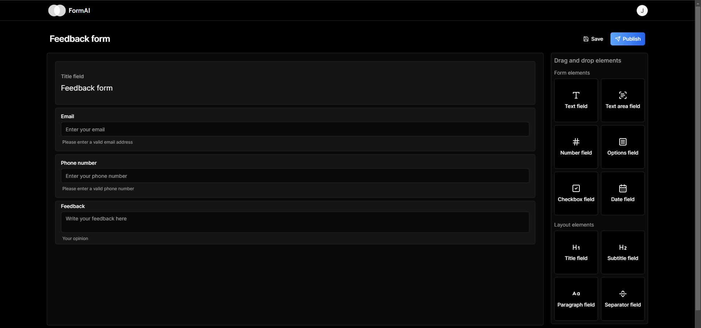

  
  
  
  
  

 
 

  <h1 align="center">FormAI</h1>
  
Create custom forms with AI and drag & drop functionality. Gather responses and analyze data with ease. Try it now!

  

     
    <a href="https://form-ai-demo.vercel.app/">View Demo</a> 
    &middot;
    <a href="https://form-ai-demo.vercel.app/">Report Bug</a>
    &middot;
    <a href="mailto:juanillaberia2002@gmail.com">Contact us</a>
  

## About The Project

With **FormAI**, creating custom forms is easy and efficient.  
Use AI to generate forms based on your needs, drag & drop to design, and gather user responses for analysis. Whether you're conducting surveys, gathering feedback, or collecting data, **FormAI** simplifies the process and allows for seamless data analysis.  

 

## 🌟 Why FormAI?  

🤖 **AI-Powered Form Creation** – Use AI to generate forms quickly and accurately  
🎨 **Drag & Drop Builder** – Design custom forms easily with a drag & drop interface  
📊 **Response Collection & Analysis** – Gather and analyze user data effortlessly  
⚡ **Fast & Efficient** – Create and deploy forms in no time  
🔒 **Secure & Private** – Ensure your user data is kept safe  

 

## 🚀 Get Started  

1️⃣ **Sign up** and create your first form  
2️⃣ **Use AI to generate** your custom form or design it manually  
3️⃣ **Drag & drop elements** to create the perfect form  
4️⃣ **Share** your form and start collecting user responses  
5️⃣ **Analyze** the data and make informed decisions  

 

## 📌 Features  

✅ **AI-Powered Form Generation** – Let AI create forms for you based on your needs  
✅ **Drag & Drop Builder** – Easily customize your forms without coding  
✅ **User Data Collection** – Gather and store user responses securely  
✅ **Data Analysis** – Analyze the collected data for insights  

 

## 🛠 Built With  

  
  
  
  
  
  

